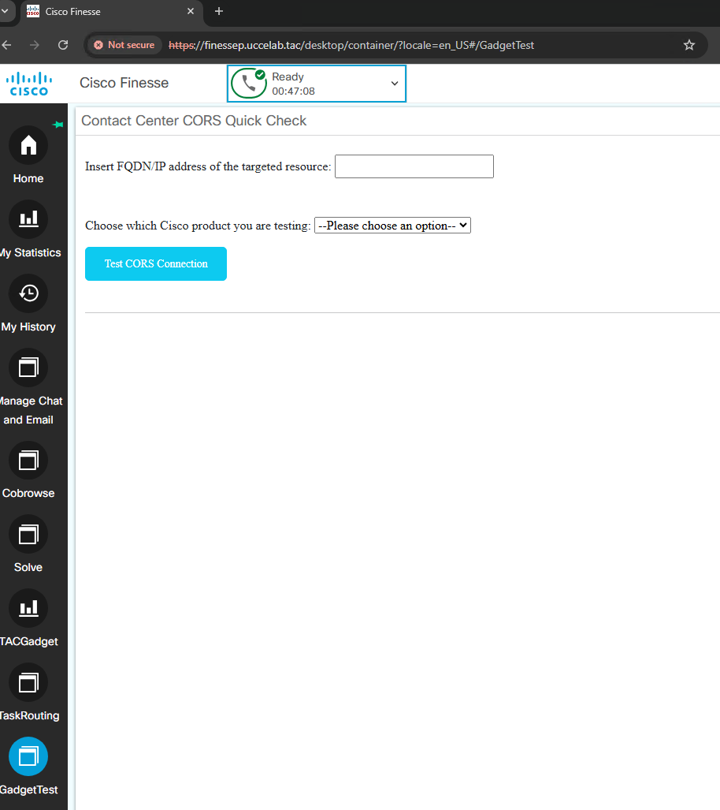

# Cisco Finesse - Contact Center CORS Quick Check

Cisco Finesse is a next-generation software application that offers features for Cisco contact center agents and supervisors in UCCE, PCCE and UCCX on the browser. It provides a web interface for agents and supervisors to login, change their state and receive calls. It also helps improve the customer experience while offering a user-centric design to enhance customer care representative satisfaction.

This gadgte is developed as a tool to help troublshooting Cross-origin resource sharing (CORS) related issues with Cisco Finesse loaded gadgtes like Lice data gadgtes and other 3rd party integrated gadgtes. What it does basically it will allow the adminisrtator to generate CORS preflight request from Finesse to memeic the situation when any reports/gadgtes have to be loaded to Cisco Finesse.

Here is a screenshot below of the gagdte/tool with the name "Contact Center CORS Quick Check". It was developed for Ciscon Finesse 12.6.2 ES03 and above, this is a 1.0 version of the gadgate/tool that has to be uploaded to Cisco Finesse server 3rdpartygadget directory in the server it self with upcoming versions it will be developed as an external server to be integrated with Cisco Finesse with more dynamic capabilities overcoming the limitations that are mentioned below sections.




This gadget contains the following files:

	Finesse CORS Project/
    	images/
        	CORSGadget.png
		
		Contact Center CORS Quick Check/
			gadget.xml
			gadget.js
			gadget.css

		readme.txt


## Requirements
1. The sample gadget and the Finesse JavaScript library requires a deployment that includes Cisco Finesse. If you do not have a system that includes Cisco Finesse, you can reserve a [DevNet sandbox](https://developer.cisco.com/docs/finesse/#!sandbox) for developing your gadget.
2. No specific configuration has be configured on Cisco Finesse
3. The destination resource like CUIC for example has to be reachable over the network before utilizing this tool
4. The destination resource's certificate either has to be imported on the browser before utilizing the tool and conduct the test or the destination resouce's certificate has to be accepted, see Accept Security Certificates section in [Cisco Finesse Agent and Supervisor Desktop User Guide](https://www.cisco.com/c/en/us/td/docs/voice_ip_comm/cust_contact/contact_center/finesse/finesse_1262/user/guide/cfin_b_1262_cisco-desktop-user-guide.html).

## Usage
If configuring the gadget to run within the Finesse desktop:
1. Place contents from Contact Center CORS Quick Check 12.6-v1.0 folder into the 3rdpartygadget directory in Finesse.
2. Add the gadget to the desktop layout under the desired role (Agent, Supervisor).
 Here is an example of valid XML for this gadget:
```xml
<gadget>/3rdpartygadget/files/gadget.xml</gadget>
```

 See the "Third Party Gadgets" chapter in the [Finesse Developer Guide](https://developer.cisco.com/docs/finesse/#!rest-api-dev-guide) and the "Manage Third-Party Gadgets" chapter in the [Finesse Administration Guide](http://www.cisco.com/c/en/us/support/customer-collaboration/finesse/products-user-guide-list.html) for more information about uploading third-party gadgets and adding them to the desktop.

 Here is the video will show more about the usage and benifites of the tools,[Watch the video](https://app.vidcast.io/share/fc7f222a-6a45-4a31-abdc-7b69ae8bc6d3)


## Additional Information
##### Cross-origin resource sharing (CORS)

The Cross-Origin Resource Sharing standard works by adding new HTTP headers that let servers describe which origins are permitted to read that information from a web browser. Additionally, for HTTP request methods that can cause side-effects on server data (in particular, HTTP methods other than GET, or POST with certain MIME types), the specification mandates that browsers "preflight" the request, soliciting supported methods from the server with the HTTP OPTIONS request method, and then, upon "approval" from the server, sending the actual request. Servers can also inform clients whether "credentials" (such as Cookies and HTTP Authentication) should be sent with requests.

For more information, you can refer to [mozilla docuemtaion](https://developer.mozilla.org/en-US/docs/Web/HTTP/CORS)

##### Finesse REST API
Documentation for the Finesse REST API can be found in the [Finesse Developer Guide](https://developer.cisco.com/docs/finesse/#!rest-api-dev-guide).

##### Finesse JavaScript Library
Documentation for the Finesse JavaScript library can be found on [DevNet](https://developer.cisco.com/docs/finesse/#!javascript-library) and is also located on the Finesse server at the following URL: http(s)://&lt;FQDN&gt;:&lt;port&gt;/desktop/assets/js/doc/index.html


## Disclaimer
This gadget is only a sample and is **NOT guaranteed to be bug free and production quality and not officaly relased by Cisco**.

The sample gadgets are meant to:
- A tool helping UCCE administators/engineers to troubleshoot and isolate CORS related issues which causes gadgets not able to be loaded properly on Cisco Finesse, this will be useful for specifc corner cases as well.